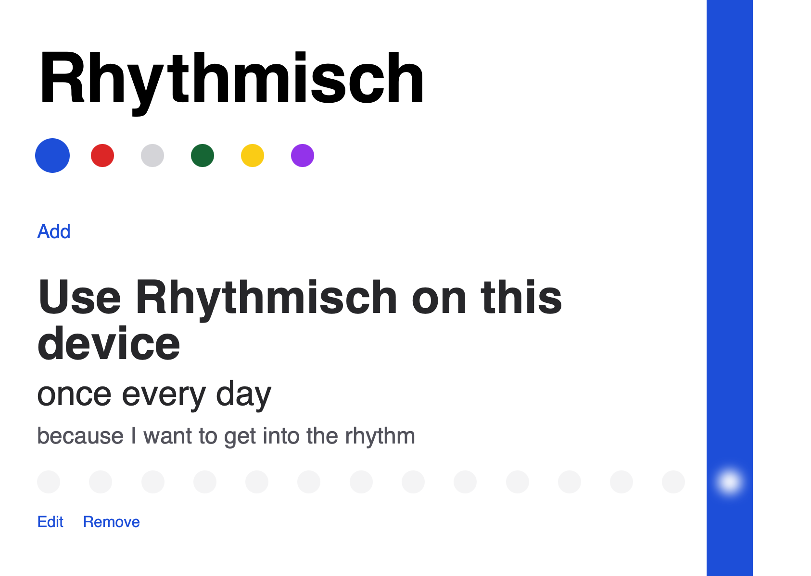

# [Rhythmisch](https://rhythmisch.com)

Rhythmisch is a simple app to help you build habits.

## Development

This app is built using:
* React
* Next.js
* Tailwind
* Storybook
* ESLint & Prettier

To get started:
1. Clone this repo
2. Run `yarn`

* Local development: `yarn dev`  (local server will run on port 3000)
* Run tests: `yarn test` (add `--watch` flag for file watcher)
* Storybook: `yarn storybook`
* Lint: `yarn lint`

## Contributions

See the [`CONTRIBUTING.md`](CONTRIBUTING.md).
